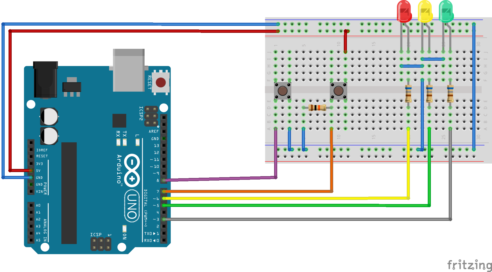
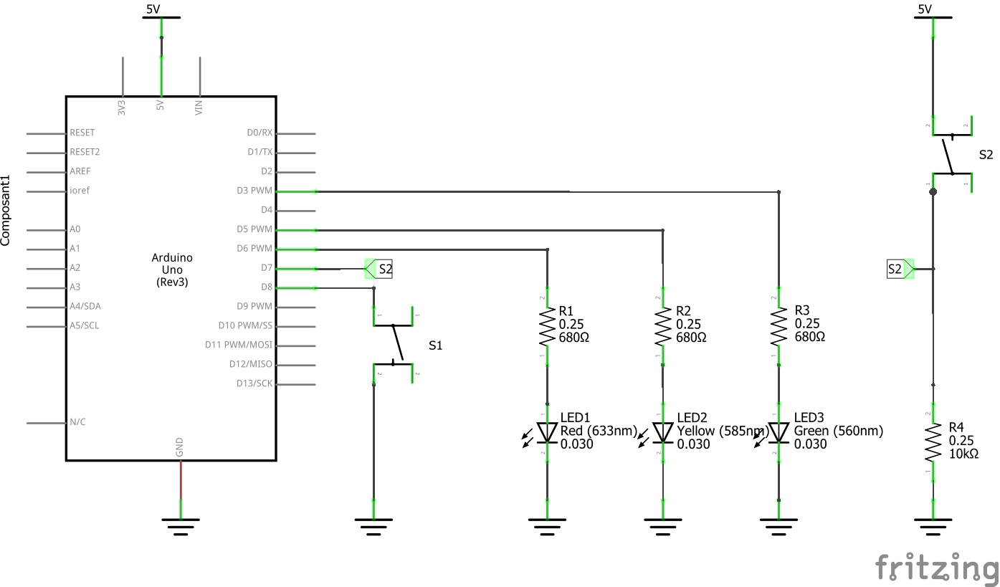

# Button

Check if a push button is pressed or released and debounce it.

This example makes use of the Arduino `Button` library.

## Hardware Required

* an Arduino board
* a push button
* hook-up wires

## Circuit

Push buttons have two wires. Two main ways exist to wire a push button:
* between an Arduino pin and the ground,
* between an Arduino pin and the power (+5V). In this case you need to have a pull-down resistor.

In the first case, reading Arduino pin will usually give you a LOW when button is pressed and HIGH when button is released. It will be the opposite in the second case.
With this library, it can be wired in one way or the other, you will not be the opposite.

The push button should be wired with one pin to ground and the other to digital pin 2 on the board.
The ground wire is typically black and should be connected to a ground pin on the board.

(Images developed using Fritzing. For more circuit examples, see the [Fritzing project page](http://fritzing.org/projects/))

## Schematic

## See also

* [check()](/docs/api.md#check)
* [isReleased()](/docs/api.md#isreleased)
* [Button library reference](/docs/readme.md)

